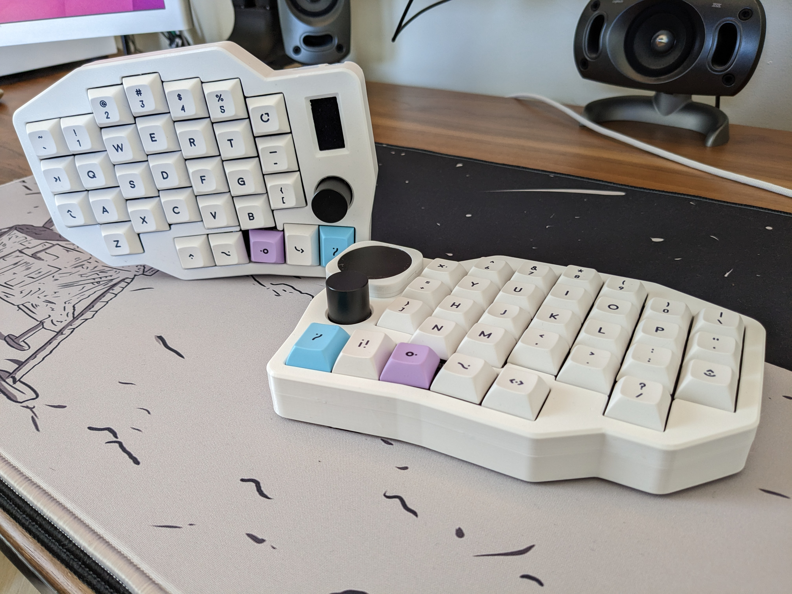
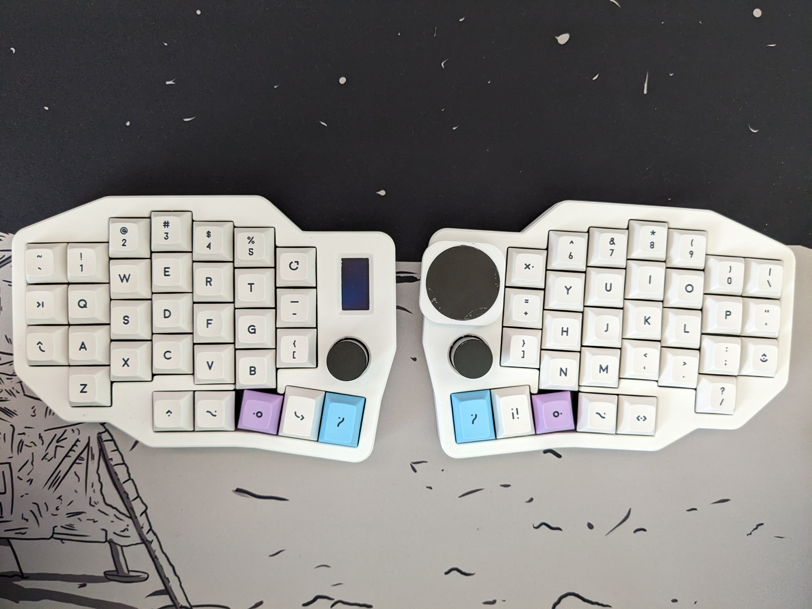
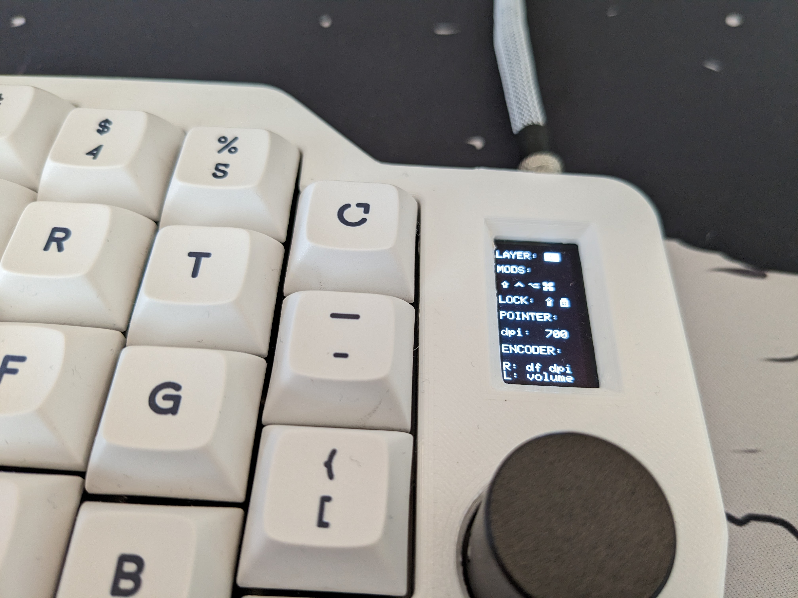
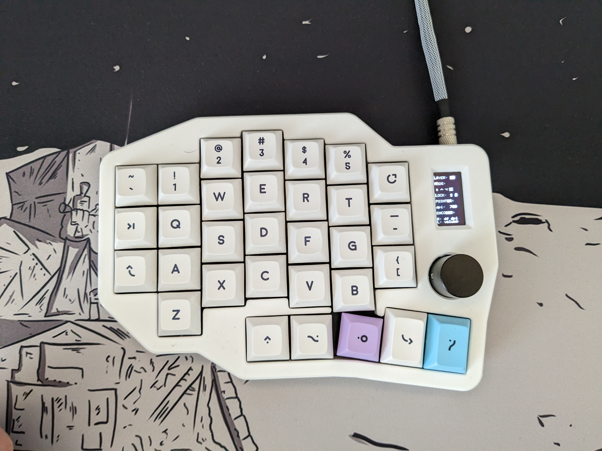
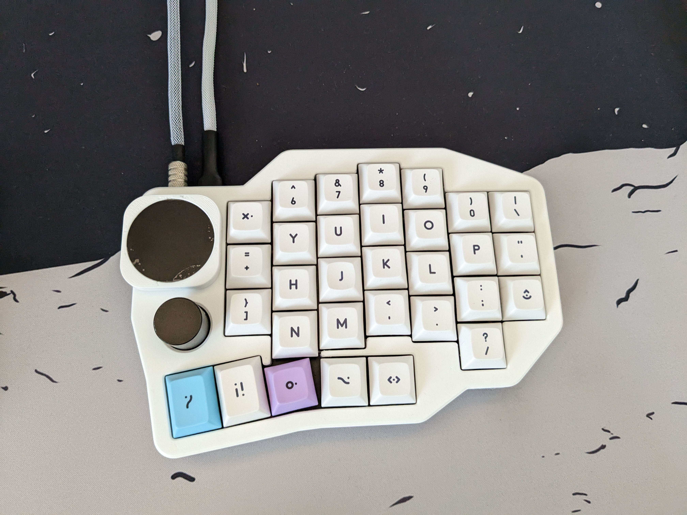
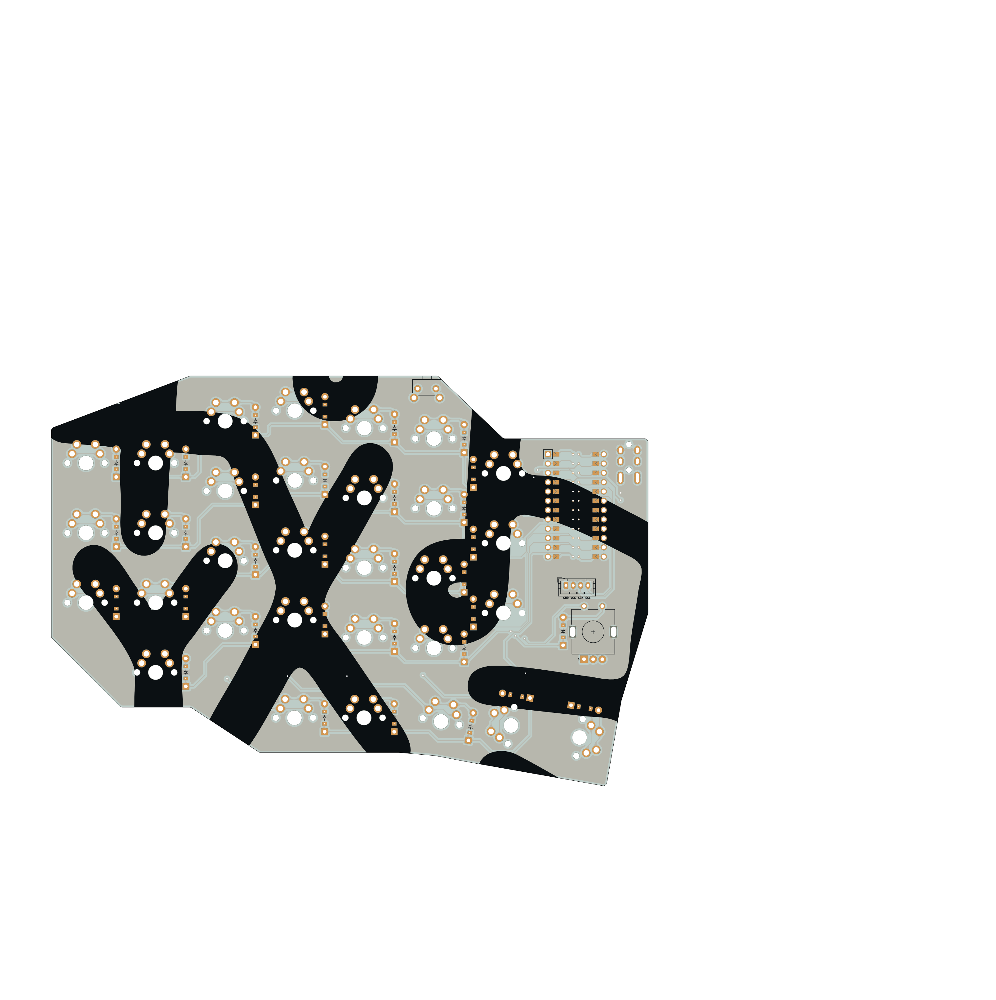

# Spleeb
Another split keyboard... a "Spleeb".

This split keyboard is created using [Ergogen](https://github.com/ergogen/ergogen/) and the routing done manually, copied back into the yaml file. This was inspired a lot by the Ergodash which I used for about a year but wanted something that fit my use and hands a bit better.

### Features

- Reversible PCB
- Optional rotary encoder replacing the bottom left key switch
- OLED screen covering the MCU on the inside of the board
- No acrylic case, only 3D printed case and plate, or cut plate
- No RGB (a joke - I don't use LEDs on keyboards but am open to accepting PRs if someone wants to do the work)

| Left | Right |
| --- | --- |
|  |  |
|  |  |

### Motivation

I'm not a fan of excessive layers, and many of the popular split keyboards are 3x5 and make heavy use of layers. I used the Ergodash for a while but found the placement of the mods to be uncomfortable, and the top row of the thumb cluster to be unused. Seeing some keyboards (like the [bastard keyboards' dilemma](https://bastardkb.com/dilemma/)) which leveraged the Cirque touchpad inspired me to create my own keyboard which allowed for the layout I wanted, along with all the bells and whistles like rotary encoders, oled screen and touchpad. A secondary purpose of this was to learn Fusion 360, KiCad, and a teensy tiny bit of C and electrical engineering.

### BOM

| Item                                                       | Quantity | Notes                                                                                                                                                                                                                                                |
|------------------------------------------------------------|----------|------------------------------------------------------------------------------------------------------------------------------------------------------------------------------------------------------------------------------------------------------|
| Spleeb PCB                                                 | 2        |                                                                                                                                                                                                                                                      |
| Spleeb Plate                                               | 2        | Intended to be cut from FR4 during PCB fab but this can be 3D printed. Extrude the plate dxf to 1.5mm and it will be 3d printable (fit accuracy depends on your printer)                                                                             |
| Cirque 35mm Touchpad Flat overlay TM035035                 | 1        | i2c only. The SPI version can be modified to use i2c.                                                                                                                                                                                                |
| SSD1306 128x64 OLED                                        | 1        | DIYmall model and footprint used in chassis model. Other brands may have fit issues with out modification of the model.                                                                                                                              |
| Pro Micro pin MCU                                          | 2        | RP2040 recomended. Boardsource Blok used in build                                                                                                                                                                                                    |
| MX switches                                                | 62       |                                                                                                                                                                                                                                                      |
| 1u keycaps                                                 | 58       |                                                                                                                                                                                                                                                      |
| 1.25u keycaps                                              | 4        |                                                                                                                                                                                                                                                      |
| EC11 Encoder                                               | 2        | Alps Alpine EC11N1524402 used in build                                                                                                                                                                                                               |
| Encoder Kob                                                | 2        | 18mm diameter                                                                                                                                                                                                                                        |
| 1N4148 Through Hole Diodes                                 | 64       | SMD diodes supported on PCB but this has not been tested                                                                                                                                                                                             |
| PJ-320A 3.5 mm jack                                        | 2        |                                                                                                                                                                                                                                                      |
| Alps Alpine SKHLLCA010                                     | 2        | Reset Switch                                                                                                                                                                                                                                         |
| JST PH 2.0 mm 4 pin straight connector                     | 2        | These are optional. Wires can be soldered directly to the though hole pads on the PCB. The connectors make disassembly easier.                                                                                                                       |
| Mill-Max 315-93 Low Profile Sockets                        | 48       | These are optional. However the height of regular headers is slightly higher than these, so may need adjusting to the USB cutout                                                                                                                     |
| Mill-Max 3320 Socket Pins                                  | 48       | These are optional. These are for the Mill-Max sockets                                                                                                                                                                                               |
| Mill-Max 3305-1 Switch Sockets                             | 124      | These are optional. These allow switches to be swapped with out resoldering                                                                                                                                                                          |
| M2x0.4mm, 2.5mm installed length threaded heat set inserts | 8        | These are optional. Current model for chassis has hole diameters for the inserts but these are parametric and can be adjusted to allow for an M2 screw directly into the plastic                                                                     |
| M2x0.4mm, 4mm installed length threaded heat set inserts   | 20       | These are optional. Current model for chassis has hole diameters for the inserts but these are parametric and can be adjusted to allow for an M2 screw directly into the plastic                                                                     |
| M2x0.4mm, 18mm length flat head screws                     | 20       | 16mm _should_ work as well. Low profile / ultra low profile heads will also work                                                                                                                                                                     |
| M2x0.4mm, 8mm length ultra low profile screws              | 2        | Regular flat head M2 machine screws should work here. It will just stick out of the inside of the chassis                                                                                                                                            |
| M2x0.4mm, 4mm length ultra low profile screws              | 6        | 2-4 are used to fix the OLED to the lid of the chassis. Regular flat head machine screws _might_ work here but the taper may interfere with fixing the OLED in place. 2 are used to for the bottom lid of the touchpad holder, these may be skipped. |
| Hookup Wire                                                | x        | Needed for OLED and Cirque Touchpad                                                                                                                                                                                                                  |
### Build Notes

Most of this build is straight forward and would follow any PCB build. Look for the diode silkscreen to know which direction didoes should go.

The original chassis CAD files created using Fusion 360 [are included](./chassis/) and the step files for all parts included as well.

### MCU Mounting and MCU Solder pads

This PCB has solder pads on each side of the PCB. These solder pads allow the MCU to be mounted on either side of the PCB - however the intended use for this build is mounting the MCUs on the *underside* of the PCB - the side opposite the switches, with the MCU LED facing up. With this orientation the solder pads should be solder on the *same side as the switches.

The solder pad opposite the through hole pad marked with the square 🔳 is RAW.

If you mount the MCU with the LED facing out on the top (same side as switches) you would solder the pads on the top.

If you mount the MCU with the LED facing out on the bottom (opposite side of switches) you would solder the pads on the bottom.

If you mount the MCU with the LED facing in on the top (same side as switches) you would solder the pads on the bottom.

If you mount the MCU with the LED facing in on the bottom (opposite side of switches) you would solder the pads on the top.

Again - with the chassis as designed the last mounting option is the only one supported:

Mount the MCU on the opposite side of the switches, with the LED facing in. Solder the pads on the same side as the switches.

#### Cirque 35mm Touchpad

Use hookup wire to solder to the GND, VCC, SDA, SCL pads, and remove the R1 resistor if the SPI version was purchased.

#### JST PH 2.0 connector

Wires should be hooked up to connector from the "outside" edge of the pcb to "inside" (PCB is reversible)

1. SCL ("outside" - white)
1. SDA (yellow)
1. VCC (red)
1. GND ("inside" - black)

#### Cirque Touchpad Holder

This needs to be redesigned. The tolerances are too tight and it scrapes the
edge of the touchpad going in/out (see the overlay lifting in the images) and
there is too much space under the touchpad pcb and can get "pushed" in. I solved
this temporarily by bunching up some electrical tape and putting it under the
touchpad between the bottom lid. The (eventual) redesign of the holder will be
inset, and include a feature on the bottom lid to press the touchpad into place,
along with having insets for the screws.

The current design is functional but not ideal.

### Printing

I used PETG but anything should work depending on your printer. I went for 75% infill to give the sound a tiny bit more thock. I didn't use supports for the 3.5mm and USB cutouts, and since I used PETG they required a little cleanup. YMMV on needing supports, but I designed the model to be printed with out supports.

### Firmware

Firmware is QMK based and [can be found in the QMK GitHub repo](https://github.com/qmk/qmk_firmware/tree/master/keyboards/spleeb).

### FAQ

##### Why is the trackpad holder separate?

I only have a Prusa Mini+ and it just doesn't have the build volume to have the holder built in. The separate holder was a compromise to allow printing of a half in one part.

There is the added benefit of the holder lifting up the touchpad above the keycaps which makes it easier to use.

## License

- All code in this repository is licensed under the [MIT](./LICENSE) license.
- All images in this repository are licensed under the [Creative Commons Attribution-NonCommercial](https://creativecommons.org/licenses/by-nc/4.0/) license.
- All CAD files in this repository are licensed under the [Creative Commons Attribution-NonCommercial-ShareAlike](https://creativecommons.org/licenses/by-nc-sa/4.0/) license.
